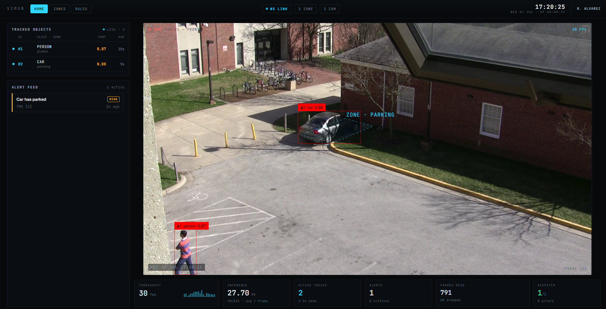
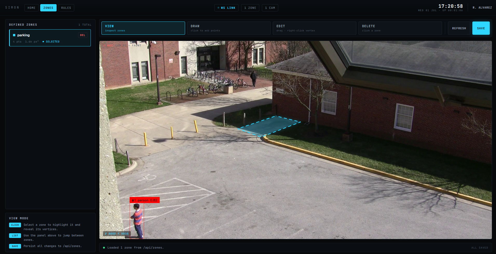
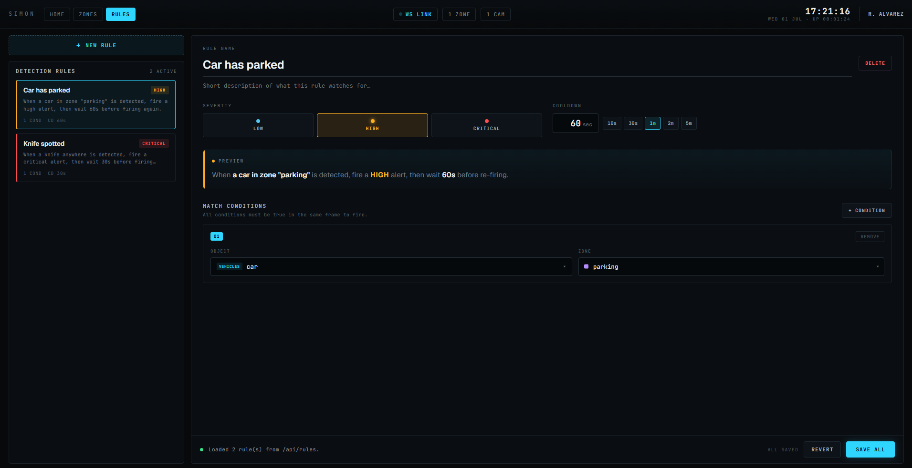

# Simon

A video surveillance application that uses OpenCV and YOLO11 for local, real-time object tracking and detection.

## Screenshots

### Home


### Zone Editor


### Rule Editor


## Prerequisites

- Python 3.8 or higher
- Git
- `pip` (comes with Python)

## Installation

### 1. Clone the repository

```bash
git clone https://github.com/RubenAlvarezGJ/simon.git
cd simon
```

### 2. Create a Python virtual environment

```bash
python -m venv venv
```

### 3.) Activate virtual environment

```bash
venv\Scripts\Activate.ps1 # for Windows powershell
```

```bash
source venv/bin/activate # for macOS/Linux
```

### 4.) Install dependencies

```bash
pip install -r requirements.txt
```

## Running locally

```bash
python server.py
python server.py --source 0
python server.py --source videos/clip.mp4 --host 0.0.0.0 --port 9000
```

Then open http://127.0.0.1:9000. `--source` takes a camera index or a file path. `server.py`
serves the built frontend from `web/dist` if it's present, so build the frontend first (below).

## Telegram notifications (optional)

Simon can push alerts to a Telegram chat. This is optional though, without it the pipeline runs
normally.

### 1. Create a bot

In Telegram, message [@BotFather](https://t.me/BotFather), send `/newbot`, and follow the
prompts. It replies with an HTTP API token, this is your `TELEGRAM_BOT_TOKEN`.

### 2. Get your chat ID

Start a chat with your new bot and send it any message, then get your numeric chat ID either way:

- Visit `https://api.telegram.org/bot<TOKEN>/getUpdates` (with your token) and read
  `result[].message.chat.id`, or
- Message [@userinfobot](https://t.me/userinfobot), which replies with your ID.

This is your `CHAT_ID`. For a group chat, add the bot to the group and use the group's chat id
(it will be negative).

### 3. Create a `.env` file

In the project root, create a `.env` file. It's git-ignored, so
the secrets stay out of version control:

```
TELEGRAM_BOT_TOKEN=<YOUR_TOKEN_HERE>
CHAT_ID=<YOUR_ID_HERE>
```

### 4. Restart the server

Restart `server.py`.

### Current notification behavior

Alerts are routed by each rule's `severity` (set in the Rule
Editor tab):

| Severity   | Telegram behavior                        |
| ---------- | ---------------------------------------- |
| `low`      | Not sent (recorded locally only)  |
| `high`     | Sent silently (no notification sound)    |
| `critical` | Sent with an audible notification        |

### Build the frontend

```bash
cd web
npm install
npm run build      # bundles into web/dist, which server.py serves
```

### Frontend dev server (optional, hot reload)

```bash
cd web
npm run dev
```

Run `server.py` alongside the dev server - Vite proxies `/api` → http://localhost:8000.
